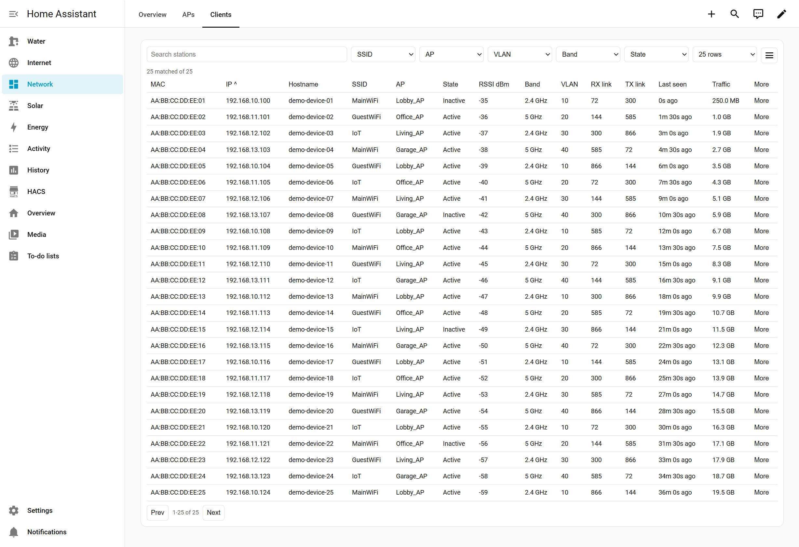
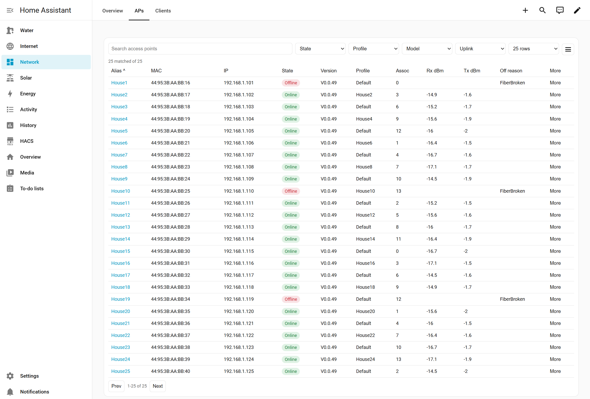
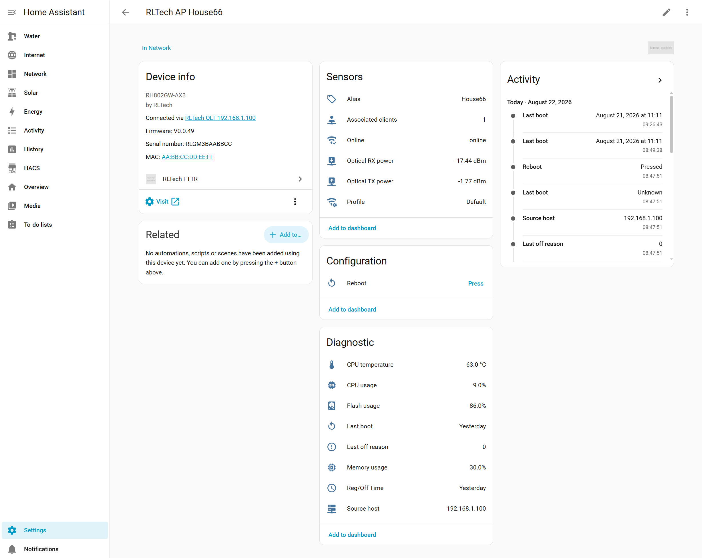
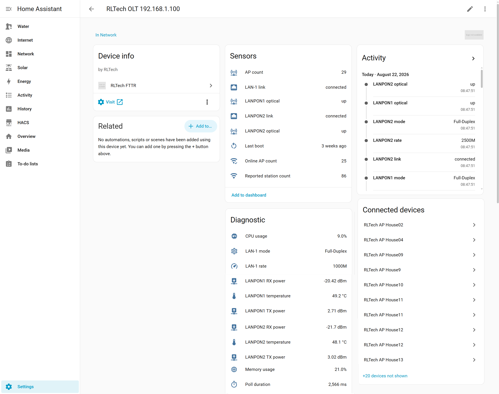

# RLTech FTTR Home Assistant integration

Custom integration for the RLTech FTTR AC (OLT/controller) and its managed
FTTR APs, read from the AC Web UI.

Requires Home Assistant `2026.9.0` or newer.

Everything essential comes from the AC Web UI on port `8080`: AP list, AP
details, Wi-Fi clients and the AC status pages. Two optional enhancements are
detected automatically when Home Assistant can reach the AC's LAN address:

- Port `80` (older OLT Web UI) for AC CPU/memory usage and ONU optical rows.
- Local MQTT on port `8883` for faster client and AP health updates between
  polls.

The AC Web UI allows a single login session, shared by all accounts. The
integration logs in once per poll and logs out right after it; see
[The AC Web UI allows one session](#the-ac-web-ui-allows-one-session).

## Features

- Adds the AC as a Home Assistant device with AP/client counts, boot time,
  uptime, CPU temperature and uplink PON / LAN-PON status.
- Adds each managed FTTR AP as its own device, using the AP serial number as
  the stable device/entity identity.
- Tracks AP online state, profile, alias, associated-client count, optical
  TX/RX power, CPU/memory/flash usage and last boot.
- Reboot buttons for each AP and for the AC itself, sent through the AC Web UI
  (port `8080`); no AP credentials are needed.
- A **Web UI polling** switch pauses polling for 15 minutes while you use the
  AC Web UI.
- Supports additional port `80` OLT hosts for downstream/slave OLTs so ONU
  optical rows can enrich APs connected behind those devices.
- Keeps Wi-Fi clients as an in-memory inventory instead of creating hundreds
  of Home Assistant tracker entities.
- An admin-only sidebar panel and two dashboard cards (client table and AP
  table) with search, filters, sorting, pagination, a mobile layout, hostname
  enrichment and MAC vendor lookup.
- Keeps the last data through short busy Web UI sessions; Repairs issues when
  the AC Web UI stays busy or unreachable; reauthentication and
  reconfiguration flows; diagnostics download with addresses and serials
  removed.

## Screenshots

### Station Table



### Access Point Table



### Access Point Device



### OLT Device



## HACS install

This repository can be installed with HACS as a custom integration.

1. Open HACS in Home Assistant.
2. Open the three-dot menu and choose **Custom repositories**.
3. Add this repository URL:

   ```text
   https://github.com/RLTechGlobal/HomeAssistant-RLTech
   ```

4. Select **Integration** as the category.
5. Install **RLTech FTTR** from HACS.
6. Restart Home Assistant.
7. Add the integration from **Settings > Devices & services**.

HACS installs the integration files, including the bundled table card
JavaScript. For the normal Home Assistant storage-mode dashboard setup, the
integration registers the bundled card resources automatically when it starts.

If your Home Assistant Lovelace resources are configured in YAML mode, add
these dashboard resources manually after the integration is installed:

```text
/rltech_fttr/rltech-fttr-station-table-card.js
/rltech_fttr/rltech-fttr-ap-table-card.js
```

Resource type: JavaScript module.

## Manual install

Copy `custom_components/rltech_fttr` into Home Assistant's
`custom_components` directory and restart Home Assistant.

## Network requirements

| Port | Needed | Used for |
|---|---|---|
| `8080` (HTTP) | Yes | AP list, AP details, clients, AC status pages, AP and AC reboot |
| `80` (HTTP) | No, automatic | AC CPU/memory usage, ONU optical rows, extra OLT hosts |
| `8883` (MQTT over TLS-PSK) | No, automatic | Faster client and AP health updates |

- **From the WAN side only port `8080` is open.** Enter the AC's WAN address
  (for example `198.51.100.29`) and everything essential works; ports `80` and
  `8883` are simply not used.
- **From the LAN side** (for example the AC LAN address `192.0.2.1`) ports
  `80` and `8883` are also reachable. The integration reads the AC's LAN
  address from the AC and probes both ports at start-up and every 30 minutes,
  in the background; reachable ones are used, unreachable ones are skipped
  silently (debug log only, no Repairs issue).
- The AC serves plain HTTP. Use it only on a trusted management network or
  over a VPN.

## Configure

Add the integration from **Settings > Devices & services**.

### AC address and login

- **AC address**: host name or IP address of the AC, WAN or LAN, without a
  port (`:8080` is accepted and ignored). Port `8080` is used automatically.
- **Username / password**: the AC Web UI account (`useradmin` or
  `administrator`; both share the one login slot).
- If port `8883` answers, a second step offers MQTT: enter the TLS-PSK
  configured on the AC, or tick "Use the factory default MQTT credentials"
  only if the AC still has them. You can skip MQTT and enable it later in the
  options.

The integration checks that the address really is an RLTech AC and uses the
AC's LAN MAC (or serial number) as the entry's identity, so the same AC
cannot be added twice. **Reconfigure** changes the address (for example from
WAN to LAN) or the login without changing entity IDs or device names; it
refuses a different AC. When the AC rejects the stored login, Home Assistant
asks for new credentials (**reauthentication**).

### The AC Web UI allows one session

The AC Web UI allows one login at a time, and the `administrator` and
`useradmin` accounts share it. Every poll logs in, reads the pages and logs
out again, usually within a few seconds, so:

- While someone is logged in to the AC Web UI, polls find the login **busy**.
  The integration keeps the last data for 3 polls (option "Busy Web UI
  grace"), then the AC entities turn unavailable until the login is free
  again. After 10 minutes of busy polls a Repairs issue explains what to do.
- A poll can end an **idle** Web UI session in a browser (the AC gives the
  slot to the new login). Use the Web UI's logout button when you are done;
  closing the tab can leave the session open until the AC times it out.
- Switch off **Web UI polling** (AC device, Configuration group) before you
  work in the AC Web UI. Polling stops at once and turns itself back on after
  15 minutes (or when you switch it on again); the AC entities show
  unavailable during the pause, and the pause survives a Home Assistant
  restart. The reboot buttons stay usable while polling is paused (a press is
  one deliberate login).
- Home Assistant logs out when it stops, so a restart never leaves the login
  held.

### Options

- **Polling interval**: default `60` seconds, minimum `30`.
- **Busy Web UI grace (polls)**: default `3`; `0` makes the entities
  unavailable at the first busy poll.
- **Remove missing APs after (days)**: default `7`; AP devices the AC has not
  reported for this long are removed. `0` never removes them automatically
  (you can still delete such a device by hand).
- **AC time zone**: see [Time and time zone](#time-and-time-zone).
- **Area for new AP devices**: existing AP devices keep their area.
- **Clients (advanced)**: keep inactive clients for (default 1 hour), mark
  clients inactive after (default 15 minutes), and switches for AP list and
  client list polling.
- **Port 80 enhancement (advanced)**: automatic by default; port 80 username
  and password; **Additional port 80 OLT hosts** for downstream/slave OLTs
  (separate several with commas, spaces or new lines; each becomes its own
  OLT device).
- **MQTT enhancement (advanced)**: automatic address (the detected AC LAN
  address) or an explicit one, credentials, PSK. Home Assistant's own MQTT
  integration is not needed.

The integration reloads after saving the options.

### AP reboot button

The AP reboot button asks the AC to reboot the AP, the same way as the reboot
action in the AC Web UI AP list: one short 8080 login, a fresh check that the
AP is online and has no unfinished task on the AC, the reboot request, then
logout. An AP takes about one minute to come back.

- The button is unavailable while the AP is offline, and while the AC Web UI
  cannot be polled (busy or unreachable).
- While **Web UI polling** is switched off, the button stays available: a press
  is a deliberate one-off login. If someone is using the AC Web UI at that
  moment the press fails with "in use by another session"; the one login slot is
  shared, so a press can also end an idle Web UI session.
- The button attributes show the last request (`last_reboot_requested`,
  `last_reboot_result`) and the AC task status (`reboot_status`:
  `0` queued, `3` rebooting, `1` completed, `2` failed; `reboot_state` spells
  it out). The status is read from the AP list on the following polls.
  While Web UI polling is switched off there are no polls, so after a press
  `reboot_status` stays at `0` (queued) until polling resumes, even though the
  AP reboots normally.
- If the AC answers the pre-check slowly (more than 7.5 s), the reboot is not
  sent: Home Assistant logs out and reports that the AC answered too slowly,
  because a late request could make the AC drop every Web UI session.
- Earlier versions logged in to the AP directly with separate AP credentials.
  Those settings are no longer shown or used; stored values are left in the
  entry untouched.

### AC reboot button

The AC reboot button (AC device, Configuration group) reboots the AC the same
way as "Device reboot" on the AC Web UI page "Management > Device management"
(`/cgi-bin/mag-reset.asp`): one short 8080 login, one request, logout.

- The request only ever carries the three fields of the reboot form
  (`rebootflag=1`, `restoreFlag=1`, `isCUCSupport=0`). The same AC page also
  holds the factory reset, USB backup and timed reboot forms; the integration
  refuses to send any other field, so a press can never restore factory
  settings.
- The request is never repeated. Only a clean answer counts as `submitted`.
  Once the request may have reached the AC, any other outcome (no answer, a
  redirect, the login page, an error status) is `submitted_unconfirmed` and
  handled like a submitted reboot, because the AC stores the reboot before
  it builds its answer and may start rebooting before it replies. Only a
  failure before anything was sent (login refused or busy, connection
  refused) is reported as an error, with no offline window.
- **Expected offline window**: after a press the AC is expected to be offline
  for up to 5 minutes (on site it took about 2 minutes). During that window
  the AC entities turn unavailable as usual, but no Repairs issue is raised,
  the failed polls are not logged as errors, polling retries every scan
  interval, and the button itself is unavailable so it cannot be pressed
  twice. The window ends early at the first successful poll after the AC went
  away. If the AC still does not answer after 5 minutes, one warning is logged
  and the normal error handling resumes. A rejected login during the window
  does not ask for new credentials (a booting AC may reject logins). If the
  AC answered every poll and its boot time did not change, one info message
  says the reboot may not have happened.
- The AC status readings (uptime, last boot, CPU temperature) are cleared when
  the reboot is sent and show unknown until the AC status pages have been read
  again after the reboot, so the old uptime is never shown for the new boot.
- Like the AP reboot button, it stays available while **Web UI polling** is
  switched off (a press is a deliberate one-off login), and is otherwise only
  available while the last poll of the AC Web UI succeeded.
- Attributes: `last_reboot_requested`, `last_reboot_result` and, during the
  window, `expected_offline_until`. The last request is also in the
  diagnostics download (`ac_reboot`): result, HTTP status, the first 300
  bytes of the AC answer with addresses, serial numbers and form values
  removed, and `reboot_observed`.
- The window lives in memory only: if Home Assistant restarts during it, the
  failed polls are reported normally.

## Time and time zone

The AC pages show some times as local clock times without a time zone: the AP
**Reg/Off Time** (PON registration or last down time) and the port 80
registration times. The integration parses them with the **AC time zone**
option: "Follow Home Assistant" (default) or a fixed UTC offset. The AC has no
readable time zone setting.

If the AC clock runs in a different time zone than the one configured, these
times are shifted by whole hours (or half hours). Durations are not affected:
**Last boot** (AC and AP) and **System uptime** are derived from the uptime
counters and are always right.

How to check: reboot an AP (or wait until one re-registers) and compare its
**Reg/Off Time** with its **Last boot**. They should be within a few minutes
of each other. If they differ by whole hours, set **AC time zone** to the
offset the AC clock actually uses (the difference tells you how far off it
is).

## What gets added to Home Assistant

Entity IDs are fixed at creation and do not depend on names:
`sensor.rltech_olt_<host>_<value>` for the AC (`<host>` is the address the
entry was created with, for example `sensor.rltech_olt_198_51_100_29_ap_count`)
and `sensor.rltech_ap_<serial>_<value>` for APs. Entity names come from the
integration's translations; a reconfigure or a new name never changes an
entity ID.

### AC device

| Group | Entity | Notes |
|---|---|---|
| Sensors | AP count, Online AP count, Reported station count | |
| Sensors | Last boot | from the AC uptime |
| Sensors | PON online status | online / connecting / offline |
| Sensors | PON link type | GPON, EPON, XG-PON, XGS-PON, 10G-EPON, GE, 10GE, GE/10GE |
| Configuration | Reboot | [AC reboot button](#ac-reboot-button) |
| Configuration | Web UI polling | [pause switch](#the-ac-web-ui-allows-one-session) |
| Diagnostic | CPU temperature | always °C |
| Diagnostic | System uptime | shown in hours |
| Diagnostic | PON TX power, PON RX power, PON temperature | |
| Diagnostic | PON voltage, PON bias current | disabled by default |
| Diagnostic | LANPONn link, TX power, RX power, temperature | per LAN-PON port |
| Diagnostic | LANPONn voltage, LANPONn bias current | disabled by default |
| Diagnostic | Poll duration | disabled by default |
| Diagnostic | CPU usage | port 80 only |
| Diagnostic | Memory usage | port 80 only, disabled by default |

Each additional port `80` OLT host gets its own device with Last boot, CPU
usage, Memory usage (disabled by default) and its LAN-PON port sensors.

- **Uplink PON** values come from the AC page "Status > Network side
  information" (`sta-network.asp`), **LAN-PON** values from "Status > User
  side information" (`sta-user.asp`), and CPU temperature, uptime and boot
  time from "Status > Device information" (`sta-device.asp`). These pages are
  read every 5 minutes, so these values can be up to 5 minutes old.
- PON online status is the page's `PonState` as the page script leaves it (on
  an AC whose uplink is an SFP or GE/2.5GE module that is the Ethernet uplink
  state); PON link type is what the page's `get_pontype()` prints. The link
  type is unknown if the page does not render the values it needs.
- Without fibre or module the optical values are unknown, never 0 V or
  -40 dBm. They are only reported while `phyStatus` is up, as on the page.
- **Stale values**: when a status page cannot be read or no longer parses,
  the last values are kept for at most two status cycles (10 minutes). After
  that the uplink PON sensors become unavailable, and CPU temperature, System
  uptime and Last boot show unknown, until the page parses again.
- **Temperatures** (AC CPU, PON, LAN-PON, AP CPU) are always shown in °C, also
  when Home Assistant uses US customary units. **System uptime** is shown in
  hours with one decimal. Entities created by earlier versions are switched to
  °C / hours once on upgrade; a display unit you picked yourself in the entity
  settings is kept.
- **LAN-PON ports** follow the AC's own port list: an RL8001GR reports only
  LANPON1, an RL8002GR LANPON1 and LANPON2. Sensors of ports the AC does not
  report are not created, and existing ones are deleted from the entity
  registry. Nothing is deleted while the list has not been read.
- **Naming**: the uplink and the LAN-PON ports share one scheme, only the
  prefix differs: "PON TX power" / "LANPON1 TX power", ..., "PON bias
  current" / "LANPON1 bias current", with matching entity IDs
  (`..._pon_tx_power`, `..._lanpon1_bias_current`).

### AP devices

| Group | Entity | Notes |
|---|---|---|
| Sensors | Online, Associated clients, Profile, Alias | |
| Sensors | Optical RX power, Optical TX power | |
| Configuration | Reboot | [AP reboot button](#ap-reboot-button) |
| Diagnostic | Reg/Off Time, Last off reason, Last boot | |
| Diagnostic | CPU usage, CPU temperature (°C) | |
| Diagnostic | Memory usage, Flash usage | disabled by default |
| Diagnostic | Source host | port 80 only, disabled by default |

- One device per managed AP that has an `SN`; AP rows without an `SN` remain
  visible in the AP table but do not create devices.
- AP device and entity IDs are based on the AP serial number, not the alias.
- AP detail values are read from the AC every 5 minutes.

### Entities disabled by default

Poll duration, memory and flash usage, the AP source host, and the PON and
LAN-PON voltage and bias current are low-value diagnostics. Every such entity
that is registered from this version on starts disabled; enable any of them in
the entity settings. That includes new entities on an existing install: an AP
the AC starts managing, a newly reported LAN-PON port, a new additional port
`80` host, or one of these entities that you deleted and that is created
again. So after an upgrade a new AP can have its Memory and Flash usage
disabled while older APs still show theirs. Entities that already existed
before this version stay enabled. In the AP table the values of disabled
entities are still shown, but the cell does not open a history dialog (a
tooltip says the entity is disabled).

### Upgrading from earlier versions

- Earlier builds created LAN port and LAN-PON status/rate/mode sensors, an
  "Uplink PON optics" summary sensor and "Uplink PON link" / "Uplink PON
  registration" sensors; they are deleted from the entity registry on
  upgrade.
- Old generated entity IDs (`..._uplink_pon_<value>`, `..._lanpon<n>_current`)
  are renamed once to the names above, keeping their history; an entity ID you
  changed yourself is left alone, and a rename whose new ID is already taken
  is skipped (logged at info level). Automations that refer to the old IDs
  must be updated by hand.

### Wi-Fi clients

Wi-Fi clients (stations) are not created as Home Assistant devices or
trackers. They are kept as in-memory rows for the client table. This avoids
hundreds of volatile client entities and unnecessary recorder history. The
**Reported station count** sensor gives the overall number for charts and
alerts.

Client host names can be enriched from Home Assistant's DHCP discovery cache
when the AC has no useful host name. Client rows also include a best-effort
MAC vendor column from the local `aiooui` OUI database installed with the
integration. Both lookups are local.

### Client data is for administrators only

Client rows contain MAC addresses, IP addresses and host names, so they are
only available to Home Assistant **administrators**:

- The sidebar panel is shown to administrators only.
- The websocket commands that return client data
  (`rltech_fttr/get_stations`, `rltech_fttr/subscribe_station_changes`) refuse
  other users with `unauthorized`. A client table card on a dashboard shows
  "Administrator access is required to view clients." to them.
- The AP table card and the entry list (`rltech_fttr/get_entries`,
  `rltech_fttr/get_access_points`) stay available to every user; they carry
  no client data.

### Sidebar panel

Once an RLTech FTTR integration is loaded, an **RLTech FTTR** item appears in
the sidebar (administrators only). It has two tabs:

- **Access points**: the AP table. Click an AP row to open the **Clients**
  tab filtered to that AP; use "Show all clients" to clear the filter.
- **Clients**: the client table.

A status bar above the tables shows the 8080 Web UI state (OK, busy,
unreachable or paused; when the data is not current it says "data frozen at
HH:MM"), whether MQTT is live, and whether client rows currently come from
MQTT or HTTP. With several RLTech entries, pick one in the header. The panel
follows the Home Assistant language (Chinese or English) and theme, and works
at phone width (tables scroll horizontally inside the page). It is removed
when the last RLTech entry is unloaded.

### Dashboard cards

The integration bundles two Lovelace cards, the same ones the panel uses:

- Station table card for Wi-Fi client lookup (administrators only).
- AP table card for managed AP inventory and AP details.

## MQTT live overlay

MQTT is optional. It complements HTTP polling and does not replace it.

- HTTP remains the authority for AP inventory, client baseline, AC status,
  LAN-PON optics, and ONU optical TX/RX.
- MQTT can make client rows fresher between HTTP polls.
- MQTT can update known AP associated-client count, CPU usage, CPU temperature,
  memory usage, flash usage, last boot, and online state.
- Unknown AP MQTT messages are ignored. AP discovery still comes from HTTP.
- The Lovelace cards do not redraw on every MQTT message. The station card can
  refresh a narrowed view with debounce/throttling when client data changes.

If MQTT is unavailable or misconfigured, the integration continues to work with
HTTP polling only.

## Station table card

Add a station card:

```yaml
type: custom:rltech-fttr-station-table-card
```

The card reads the latest coordinator data through the integration websocket
API and supports search, sort, and filters for SSID, AP, VLAN, band, and active
state. The AP filter matches the AP MAC address, so duplicate or empty aliases
are not ambiguous.

To pin a card to one AP (for example on that AP's device dashboard), set its
MAC; the AP selector is then replaced by a fixed label:

```yaml
type: custom:rltech-fttr-station-table-card
ap_mac: E0:21:FE:B0:B0:00
```

If you are not a Home Assistant administrator the card shows "Administrator
access is required to view clients." instead of the table (see
[Client data is for administrators only](#client-data-is-for-administrators-only)).

A station is `Active` when it appears in the latest successful station
poll, and `Inactive` while it is retained from an earlier poll. Inactive rows
expire after the configured station retention window.

The visible columns, mobile columns, page size, sort order, and filters can be
changed in the card's table options menu. By default those UI preferences are
remembered in the current browser's local storage. Search text is intentionally
not remembered. On phone-sized screens the card switches from a wide table to a
compact row layout using `mobile_columns`.

## AP table card

Add an AP inventory card:

```yaml
type: custom:rltech-fttr-ap-table-card
```

The AP card uses the same websocket pattern and supports search, sort, and
filters for online state, profile, model, and uplink. It shows AP inventory
fields such as alias, MAC, IP, firmware, association count, uplink, serial
number, and ONU optical/status details when hardware status polling is enabled.

The AP card works for every Home Assistant user: AP rows carry no client
data.

Source ownership is intentionally strict:

- Port `8080` provides AP inventory, station inventory, AP details and the AC
  status pages.
- Port `80` (optional, LAN only) adds AC CPU/memory usage and ONU/AP
  optical/status rows.
- The first port `80` source is the main AC. Additional port `80` hosts are
  represented as separate OLT hardware devices.
- AP optical/status rows from port `80` are joined to AP inventory by AP serial
  number, not alias, MAC, or IP.
- `Reg/Off Time` is parsed with the **AC time zone** option (see
  [Time and time zone](#time-and-time-zone)). For online ONUs it appears to be
  registration time; for offline ONUs it appears to be off time.

The AP table receives the current HA entity IDs from Home Assistant's entity
registry; clicking AP-backed cells such as alias, state, profile, or associated
station count opens the normal HA more-info/history dialog. Other AP fields,
including channels, uplink details, ONU interface, and source OLT host, remain
inventory-only table data.

Both table cards accept:

```yaml
entry_id: optional_config_entry_id
page_size: 25
mobile_page_size: 10
page_size_options:
  - 25
  - 50
  - 100
remember_preferences: true
storage_key: optional_unique_key
columns: []
mobile_columns: []
```

When exactly one RLTech FTTR integration is configured, `entry_id` can be
omitted and the card will select it automatically. Set `entry_id` only when
multiple RLTech FTTR integrations are configured. The visible columns, mobile
columns, and page size have built-in defaults and can be changed from the
card's table options menu.

Use `storage_key` if you place multiple cards for the same config entry on
different dashboards and want separate remembered browser layouts.

Both cards also accept `show_sources: false` to hide the data source status
bar (8080 state, "data frozen at HH:MM" while the AC Web UI is busy, MQTT
state, client data source). The AP table shows a **Clients** column with the
number of clients the AC reports online on each AP, next to the AP's own
associated-client count. Card texts follow the Home Assistant language
(Chinese or English, English by default). Both cards implement
`getGridOptions()` and take the full width of a sections dashboard by default.

The AP table also accepts `default_sort_key` and `default_sort_dir`. By default
APs are sorted by `online` ascending, so offline APs appear first.

## Removing the integration

1. **Settings > Devices & services > RLTech FTTR**, open the entry's menu and
   choose **Delete**. Home Assistant removes its devices and entities; the
   integration logs out of the AC, deletes its per-entry bookkeeping file and,
   with the last entry, the sidebar panel.
2. If you added the dashboard cards, remove them from your dashboards. The
   card resources (`/rltech_fttr/rltech-fttr-station-table-card.js`,
   `/rltech_fttr/rltech-fttr-ap-table-card.js`) stay under **Settings >
   Dashboards > Resources**; delete them there (or from your YAML resources).
3. Remove the integration files: in HACS open **RLTech FTTR** and choose
   **Remove**, or delete `custom_components/rltech_fttr` for a manual install.
   Restart Home Assistant.

Nothing is changed on the AC.

## Known limitations

- The AC Web UI allows one session: polling and a person in the Web UI
  compete for it (see above). Pause polling while you use the Web UI.
- From the WAN side only port `8080` is available: no CPU/memory usage, no
  ONU rows from port 80, no MQTT live updates.
- AC status values (uptime, CPU temperature, PON/LAN-PON) are read every 5
  minutes; AP detail values every 5 minutes.
- Times shown on AC pages depend on the **AC time zone** option being right
  (see [Time and time zone](#time-and-time-zone)).
- Uplink PON optical values are only shown while the page reports the PON
  physical link up; with a module or Ethernet uplink they stay unknown.
- Wi-Fi clients are not entities; use the cards or the panel.
- The AC reboot window and the last reboot result are kept in memory only.
- Entity names are English (translations for other languages are not
  included yet).

## Troubleshooting

| Symptom | Cause and fix |
|---|---|
| AC entities unavailable, Repairs "Web UI is in use by another session" | Someone holds the AC Web UI login. Log out in every AC Web UI tab (or wait for the AC to time the session out). Switch off **Web UI polling** while you work there. Home Assistant recovers within one poll once the login is free. |
| "The AC Web UI login is locked" | Too many wrong passwords were typed (usually in a browser). Wait until the AC unlocks the login; Home Assistant does not ask for new credentials for this. |
| Reauthentication notification | The AC rejected the stored login (password changed). Open the notification and enter the current Web UI username and password. |
| Repairs "Web UI is unreachable" (after 30 minutes) | Home Assistant cannot reach port `8080`. Check that the AC is on and reachable; if its address changed, use **Reconfigure**. |
| No CPU/memory usage, no MQTT | Normal on a WAN address: ports `80`/`8883` are LAN only. Use the LAN address if Home Assistant can reach it. |
| Times such as Reg/Off Time are hours off | Set the **AC time zone** option (see [Time and time zone](#time-and-time-zone)). |
| A client table card shows "Administrator access is required" | The dashboard user is not a Home Assistant administrator; client data is admin-only. |
| Something else | Download the diagnostics (entry menu > **Download diagnostics**; addresses, MACs, serials and secrets are removed) and enable debug logging for `custom_components.rltech_fttr`. |

## License

Licensed under the [Apache License 2.0](LICENSE). This integration is based on
[ha-rltech-fttr](https://github.com/hmsta/ha-rltech-fttr) by hmsta, used under
the MIT License; see [NOTICE](NOTICE) and [LICENSE-MIT](LICENSE-MIT).
